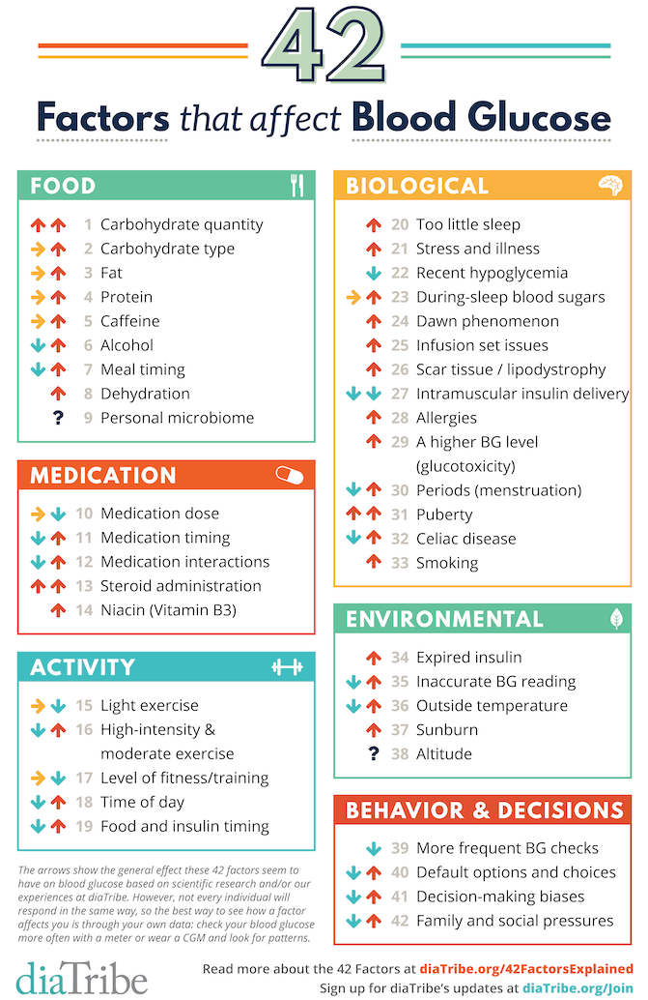

# Diabetes

Diabetes is a chronic condition that occurs when the pancreas no longer produces insulin, or the body cannot use insulin effectively.

Insulin is a hormone produced by the pancreas that acts like a key to allow glucose from the food we eat to pass from the bloodstream into the body's cells to generate energy. The body breaks down all carbohydrate foods into glucose in the blood, and insulin helps glucose move into the cells.

When the body is unable to produce or use insulin effectively, blood glucose levels rise, leading to hyperglycaemia. Prolonged high glucose levels can cause
damage to the body and result in the failure of various organs and tissues.

There are several types of diabetes exist, the two most common are type 1 and type 2. This project specifically focuses on type 1 diabetes.

## Diabetes Type 1 

Type 1 diabetes is an autoimmune condition where the body attacks the insulin-producing cells in the pancreas. It is typically diagnosed in children and young adults and was previously known as juvenile diabetes. Individuals with type 1 diabetes must take insulin dayly to survive.

## Blood Glucose

Blood glucose levels indicate the amount of glucose in the blood and are typically measured in millimoles per litre (mmol/L) or milligrams per decilitre (mg/dL). These levels are usually measured before meals, after meals, and at other various times throughout the day.

Managing blood glucose levels is a key part of managing diabetes. Individuals with diabetes need to maintain their blood glucose levels within a target range to minimize the risk of complications.

## Known Complications of Unmanaged Diabetes

* Hyperglycemia (high blood sugar)
  * Fatigue, dehydration, increased thirst, frequent urination, blurred vision, and headaches.
* Hypoglycemia (low blood sugar)
  * Symptoms include shakiness, dizziness, sweating, hunger, irritability, headache, and blurred vision.

Long-term complications of unmanaged diabetes include:

* Heart disease
* Kidney disease
* Nerve damage
* Eye damage
* Foot damage

## Blood Glucose Fluctuation over a Day {cite}`Wikipedia_2024_diabetes`

The following figure illustrates typical blood glucose level fluctuations throughout the day, influenced by meals, physical activity, and other factors. The accompanying chart highlights the patterns and variability that can occur in glucose levels, emphasizing the importance of monitoring and maintaining a healthy range.  

## Target Blood Glucose Levels and Ranges in Type 1 Diabetes {cite}`Seery_2022`

The following figure shows the recommended target blood glucose levels for people with type 1 diabetes.
For this type, the target range is usually between 4.0 and 7.0 mmol/L before meals and less than 9 mmol/L 90 minutes after meals.

## Factors Influencing Blood Glucose Levels {cite}`Brown_2022`

The following figure lists various factors that can impact blood glucose levels. Upward arrows indicate factors that generally increase blood glucose, while sideways arrows represent a neutral effect. 

Responses to factors influencing blood glucose levels can vary significantly between individuals and even within the same person over time.
Certain factors may have different impacts depending on whether a person has type 1 or type 2 diabetes.
Factors marked with upward and downward arrows are particularly challenging to manage.
The most reliable way to understand how a factor affects your blood glucose is through personal experience and observations.

## The importance of Blood Glucose Prediction

Predicting blood glucose levels is essential for effective management of type 1 diabetes.

Anticipating changes in blood glucose over the next hour allows individuals to make informed decisions about insulin dosages, dietary choices, and physical activity. Accurate predictions enable proactive adjustments, helping to prevent dangerous highs or lows.

Maintaining blood glucose levels within the target range can help reduce the risk of complications associated with diabetes.
