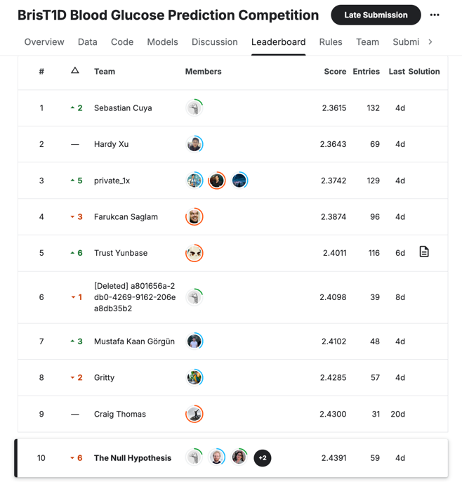

# Conclusions

In this chapter, we described and explained another approach to predicting blood glucose levels one hour ahead using participant data with lag features.
The approach involved extensive data exploration, feature engineering, and model tuning to achieve optimal performance.

## Key Highlights:
1. Data Augmentation:
    * Unlike the first approach, where only the original training data was used, we augmented the training data by shifting the test data by a minimum of 1 hour and a maximum of 4 hours to generate additional samples. This strategy increased both the quantity and quality of training data.
2. Feature Engineering and Preprocessing:
    * We explored the dataset carefully, identified the most important features, and engineered features to enhance model performance.
3. Model Evaluation and Selection:
    * Using LazyPredict, we evaluated multiple models and identified the top-performing ones for further fine-tuning. 
    * We developed a set of custom HyperParameterTuner classes for the best performing models identified by LazyPredict, which automatically perform Bayesian Optimization (BayesSearchCV) and a 5-fold cross-validation to identify an optimal set of hyper-parameters. 
    * Hyperparameter tuning was conducted using BayesSearchCV (Bayesian Optimization) and 5-fold cross-validation to identify an optimal set of hyper-parameters.
    * Then, we fine-tuned the models using the optimal hyper-parameters, evaluated their performance and selected the best performing models from different categories.
    * Based on the selected models, we could determine the most important features, which are within the last 1 hour of data. Having this information, we could adjust our data augmentation to further improve the quantity and quality of data.
4. Stacking Ensemble:
    * The best-performing models from different categories were combined into a ``StackingRegressor`` ensemble model with ``Ridge`` as the meta-learner.
    * We evaluated the ensemble model and showed that StackingRegressor outperformed individual models, demonstrating the benefits of combining diverse algorithms.
5. Final Model Performance:
    * The final model predicted blood glucose levels one hour ahead using six hours of participant data.
    * Submissions to the Kaggle competition were evaluated based on Root Mean Square Error (RMSE) between the predicted blood glucose levels and the actual values.
    * Our model achieved an RMSE of **2.4224** on the test data.

### Kaggle Results:
* Public Leaderboard Rank: 4
* Private Leaderboard Rank: 10

> In conclusion, we successfully developed a remarkable model that predicts blood glucose levels one hour ahead with a high degree of accuracy. This predictive capability can significantly aid individuals with type 1 diabetes in managing their condition more effectively.