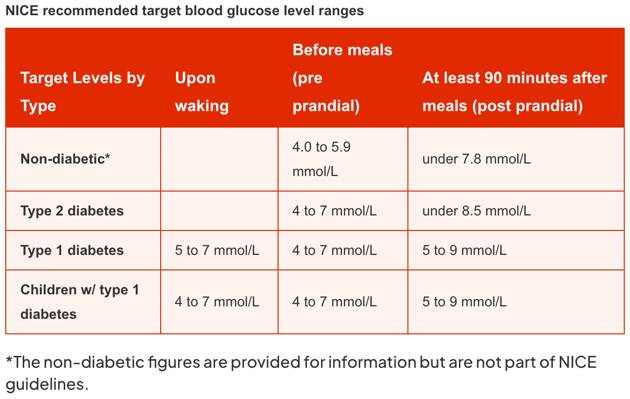

# Diabetes Type 1

Diabetes is a chronic condition that occurs when the pancreas can no longer make insulin, or the body cannot effectively use insulin.

Insulin is a hormone made by the pancreas that acts like a key to let glucose from the food we eat pass from the bloodstream into the cells in the body to produce energy. The body
breaks down all carbohydrate foods into glucose in the blood, and insulin helps glucose move into the cells.

When the body cannot produce or use insulin effectively, this leads to high blood glucose levels, called hyperglycaemia. Over the long-term high glucose levels are associated with
damage to the body and failure of various organs and tissues.

Various types of diabetes exist, but the two most common types are type 1 and type 2 diabetes. This project focuses on Type 1 diabetes.

## Type 1 Diabetes

Type 1 diabetes is an autoimmune condition where the body attacks the cells in the pancreas that make insulin. It is usually diagnosed in children and young adults, and was
previously known as juvenile diabetes. People with type 1 diabetes need to take insulin every day to stay alive.

## Blood Glucose

Blood glucose levels are a measure of the amount of glucose in the blood. They are usually measured in millimoles per litre (mmol/L) or milligrams per decilitre (mg/dL). Blood
glucose levels are usually measured before meals, after meals, and at other times throughout the day.

Managing blood glucose levels is a key part of managing diabetes. People with diabetes need to keep their blood glucose levels within a target range to reduce the risk of
complications.

## Known complications of unmanaged diabetes

* Hyperglycemia (high blood sugar)
  * Fatigue, dehydration, increased thirst, frequent urination, blurred vision, and headaches.
* Hypoglycemia (low blood sugar)
  * Symptoms include shakiness, dizziness, sweating, hunger, irritability, headache, and blurred vision.

Long-term complications of unmanaged diabetes include:

* Heart disease
* Kidney disease
* Nerve damage
* Eye damage
* Foot damage

## Blood Glucose Fluctuation over a day

##  

## Target Blood Glucose Levels and Ranges in Type 1 Diabetes

https://www.diabetes.co.uk/diabetes_care/blood-sugar-level-ranges.html

- add the table here in markdown -

## Factors Influencing Blood Glucose Levels

--- Mathias had a nice slide on this

## The importance of Blood Glucose Prediction

Predicting blood glucose levels is crucial for managing type 1 diabetes.

Knowing how blood glucose levels within the next hour will change can help individuals with type 1 diabetes make informed decisions about their insulin dosages, diet, and physical
activity.

Maintaining blood glucose levels within a target range can help reduce the risk of complications associated with diabetes.
