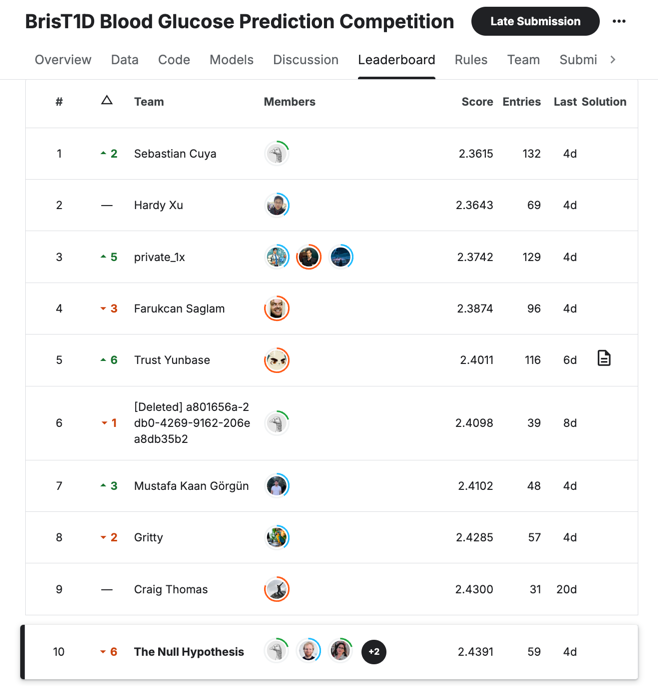

# Conclusions

In the previous sections, we described our approach to predicting blood glucose levels one hour ahead using participant data with lag features.

The main difference to the approach in model 1 was the the augmentation of training data from the test data.
This was done by shifting the test data by minimum 1 hour and maximum 4 hours to create new training data.

We started by exploring the dataset and understanding the features, then we preprocessed the data and engineered new features to improve the model's performance.

We evaluated the performance of several models using LazyPredict and selected the best performing ones for further tuning. We created a series of HyperParameter Tuner classes for
the best performing models identified from LazyPredict, which automatically performed Grid Search using BayesSearchCV and a 5-fold cross-validation to identify an optimal set of
hyper-parameters. We then fine-tuned the models using the optimal hyper-parameters and evaluated their performance. Finally, we selected the best performing models from different
categories.
With these models we could determine the most important features. We found that the most important features are within the last 1 hour of data.
With this information we could adjust our data augmentation to further improve the quantity and quality of data.

We did Hyperparameter tuning for our previously selected models and chained them together to create an `StackingRegressor` ensemble model.
We evaluated the ensemble model and could show that it outperformed the individual models.

The final model was then used to predict blood glucose levels one hour ahead using the previous six hours of participant data.

Submissions were evaluated on Root Mean Square Error (RMSE) between the predicted blood glucose levels an hour into the future and the actual values that were then collected.
The Kaggle competition finished and our model achieved a RMSE of 2.4224 on the test data.

With this score we achieved a rank of 4 on the public leaderboard and a rank of 10 on the private leaderboard.

In conclusion, we have successfully developed a remarkable model that can predict blood glucose levels one hour ahead with a high degree of accuracy. This model can be used to help
individuals with type 1 diabetes manage their condition more effectively.

## Further Work

In the future, we could explore the following areas to improve the model:

- **Feature Reduction**: We could explore feature reduction techniques to identify the most important features and reduce the dimensionality of the dataset.
- **Noise Reduction**: We could explore techniques to reduce noise in the data and improve the quality of the predictions.
- **Cross-Validation**: We could explore different cross-validation techniques which reflect better the Kaggle score.
