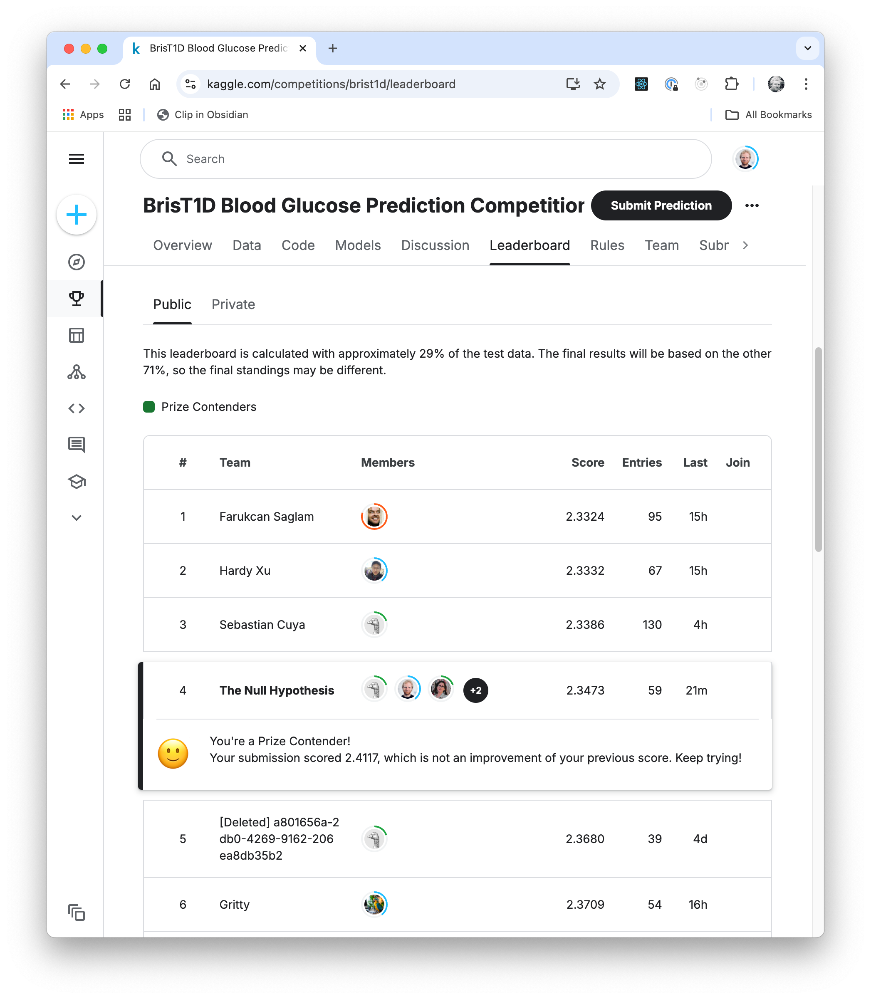

# Summary and Final Thoughts

In this report, we presented our approaches to predicting blood glucose levels one hour ahead using six hours of participant data. Our work involved a comprehensive workflow, including data exploration, preprocessing, feature engineering as well as model training. Furthermore, a custom cross-validation strategy was implemented to evaluate model performance and optimize its hyperparameters.

## Two Modelling Approaches
We developed two different modelling approaches. The first approach utilized the training data as provided, while the second one augmented the training dataset by generating additional data from the test data, shifting it by one to four hours. This data augmentation strategy significantly improved the model's performance by providing additional training examples.

Our continious trials with different types of models achieved a Kaggle Score of 2.45 on the public leaderboard, which was a significant improvement over the baseline model. So we kept further validations using a custom cross-validation strategy, which showed consistent results across different folds.

## Results

Our best model achieved a Kaggle Score of **2.3472** on the public leaderboard, which looked very promising. Post-competition evaluation on the private leaderboard, assessing 80% of the unseen test data, yielded an RMSE of **2.4391**, which means that our model was able to predict 20% of the test data with this RMSE. Based on this evaluations, our model was ranked 10th in the competition. 

## Challenges

We encountered several challenges during the development of our models, which we tried to address through various strategies.

### Imbalanced Training and Test Data

One of the main issues was the imbalance between training and test data, as some patients in the test set were absent from the training set. This made predictions for these patients particularly challenging. To address this, we leveraged data augmentation techniques to create additional training samples derived from the test data.

### Kaggle RMSE and Local RMSE Discrepancy

Another big challenge was the discrepancy between local RMSE scores and Kaggle leaderboard scores. Despite implementing various strategies such as feature selection, hyperparameter tuning, and refined cross-validation, the gap persisted. We have different hypotheses on why this discrepancy exists, which have to be proven in future work.

* The number of features is too high and introduces noise into the model.
* The model is overfitting the training data (Trees too deep, KNeighbors too low) and not generalizing well to the test data on Kaggle.
* The model is not able to capture the underlying patterns in the data.

## Future Directions

This project successfully demonstrated the utility of data augmentation and ensemble modelling.
To enhance the model's performance and generalization, the following areas could be explored deeper in the future:

- **Feature Reduction**: We could explore further feature reduction techniques to identify the most important features and reduce the dimensionality of the dataset.
- **Noise Reduction**: We could explore techniques to reduce noise in the data and improve the quality of the predictions.
- **Cross-Validation**: We could explore different cross-validation techniques which reflect better the Kaggle score.
- **Deep Learning Approaches:** Although our attempt to integrate a basic Deep Neural Network (DNN) into the Stacking Ensemble model did not yield significant improvements, more sophisticated deep learning architectures and strategies could be explored in the future to unlock additional potential.

By addressing these areas, the model could achieve even greater accuracy and reliability, providing more value to users and competitive performance in future challenges.

## Final Thoughts

This project has been an incredible learning experience for our team. We have gained valuable insights into data preprocessing, feature engineering, model development, and performance evaluation. We also learned how to work
collaboratively on such a project, communicate effectively, and solve problems as a team. We applied various machine learning techniques as well as integrating them into a robust ensemble model like stacking.

Our solution was ranked in the **top 1% of the Kaggle public Leaderboard**, which is a great achievement for us and a reflektion of the hard work we invested in this project. This achievement is something we are genuinely proud of, as it reflects our effort of out team. We believe that the skills and knowledge we have developed during this project will be valuable in our future careers as data scientists and machine learning engineers.
